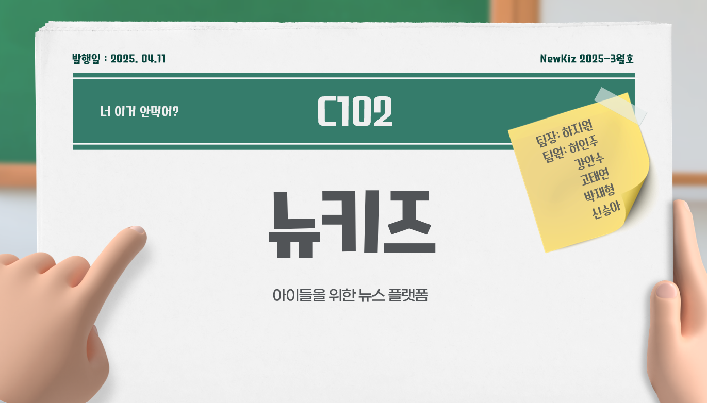
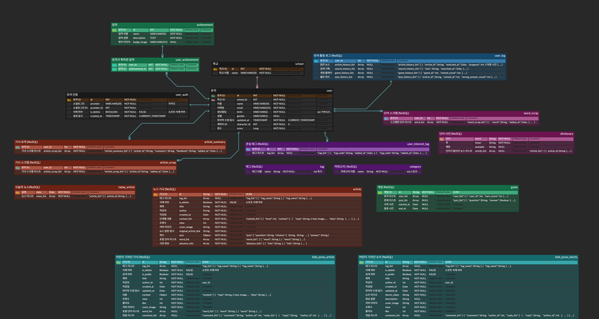
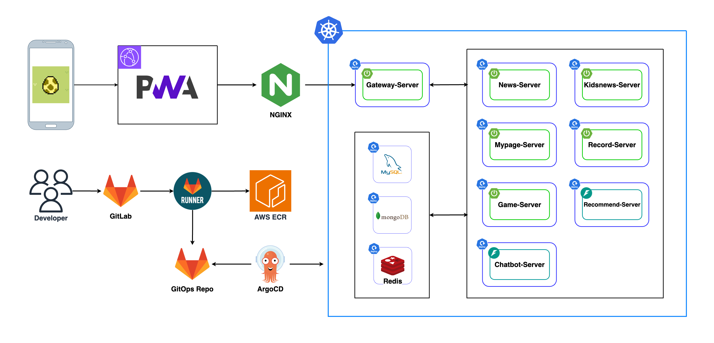

# 📰뉴키즈(NewKiz)

---
## 📚 목차 (Table of Contents)

- [🧭 프로젝트 소개](#-프로젝트-소개)
- [🔄 사용자 플로우](#-사용자-플로우)
- [🎯 주요 화면 및 기능 소개 ](#-주요-화면-및-기능-소개)
- [📘 ERD](#-erd)
- [📦 아키텍처 요약](#-아키텍처-요약)
- [🛠 사용된 기술 스택](#-사용된-기술-스택)
- [👥 팀 구성](#-팀-구성)

---

## 🧭 프로젝트 소개

> 서비스 명: AI 어린이 뉴스 플랫폼  
> 기간: 2025.03.04 ~ 2025.04.11

### 💡 기획의도
- 요즘 아이들은 문장을 이해하고 해석하는 문해력이 낮습니다.
- 아이들은 뉴스가 어렵고 복잡하다고 느껴 사회 문제에도 관심이 적습니다.
- **뉴키즈는**  다양한 난이도의 뉴스 읽기와 퀴즈, 게임 요소 및 AI 요약 기능을 제공해 문해력과 사회적 이해를 높이는 뉴스 플랫폼입니다. 

---

## 🔄 사용자 플로우

1. **난이도 설정 및 캐릭터 선택**
2. **뉴스 읽고 퀴즈 풀기**
3. **뉴스 읽고 뉴스 요약**
4. **퀴즈 대결 참여**
5. **나만의 뉴스 작성**

---

## 🎯 주요 화면 및 기능 소개
### 메인 화면 

- 🗞️ **오늘의 주요 뉴스 10개 추천**
- 🎯 **사용자 설정 카테고리별 맞춤 뉴스 추천**
 

### 뉴스 화면 

- ✍️ **난이도별 기사 내용 제공**

 

  
  
  

- 🧠 **사용자 요약 vs AI 요약 비교**  
- 🖊 **객관식 퀴즈로 이해도 점검** 
- 🔍 **읽은 기사와 관련된 유사 뉴스 자동 추천** 
- 🤖 **모르는 단어/용어 뜻을 알려주는 챗봇**
 

### 게임 화면

- 🎮 **게임**

### 기자단 화면

- 📝 **기사 작성 및 커뮤니티 소통 기능**

---

## 📘 ERD

---

## 📦 아키텍처 요약

---

## 🛠 사용된 기술 스택

### 🖥️ Frontend

### 🛠 Backend

### ⚙ DevOps & Infra

---
## 👥 팀 구성

<table>
  <tbody>
    <tr align="center">
      <td> </td>
      <td> </td>
      <td> </td>
      <td> </td>
      <td> </td>
      <td> </td>
    </tr>
    <tr align="center">
      <td width="200"><a href="http://github.com/haazz">팀장 : 하지원 BE/AI</a></td>
      <td width="200"><a href="http://github.com/jjoonior">팀원 : 허인주 BE/Infra</a></td>
      <td width="200"><a href="https://github.com/">팀원 : 고태연 FE</a></td>
      <td width="200"><a href="https://github.com/kangansoo">팀원 : 강안수 FE</a></td>
      <td width="200"><a href="https://github.com/arnold714">팀원 : 박재형 BE</a></td>
      <td width="200"><a href="https://github.com/newww-a">팀원 : 신승아 FE</a></td>
    </tr>
    
  </tbody>
</table>
